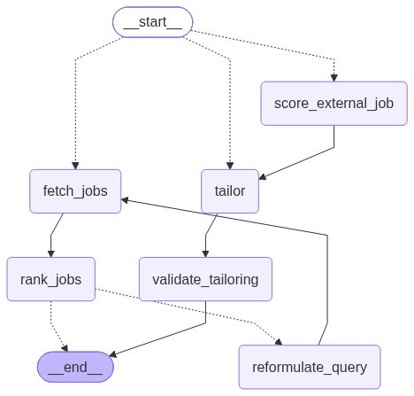

<div align="center">


### 🧭 An AI agent that finds jobs that actually fit — and tailors your CV without lying about it

<p>
  
  
  
  
  
</p>

</div>

---

## 🎯 What Joblyst does

Give it your resume. It **extracts a structured profile**, **searches five live job boards concurrently**, **ranks every result against you with an LLM**, and — if the first pass comes back thin — **automatically broadens the search and tries again**. Then, for any job you pick, it **tailors your CV and writes a cover letter**, and runs every single generated claim through a **fabrication checker** before you ever see it — so nothing it writes says something your real CV doesn't back up.

It's built as a genuine multi-node **LangGraph agent**, not a prompt wrapper: typed state, conditional routing, checkpointed threads, per-node tracing, and a circuit breaker on LLM spend.

## ✨ Features

- 📄 **CV parsing → structured profile** — `pypdf` extraction feeding an LLM that turns raw resume text into a typed `Profile` (seniority, skills, roles, years of experience, locations)
- 🔎 **Five-source concurrent job search** — JSearch, Adzuna, Remotive, Himalayas, and Jooble queried **in parallel** via a thread pool, with a soft-deadline cascade so one slow source never blocks the fast ones
- 🧠 **LLM-driven query selection** — the model picks the search title, country, and remote flag itself; you watch it decide in the trace
- 📊 **Batched, parallel ranking** — every job scored 0–100 for fit against your profile, with matched skills and honest gaps, batched and run concurrently to keep latency down
- 🔁 **Self-reformulating search** — if fewer than 5 jobs clear a 60+ fit score, the agent rewrites its own query and searches again (capped, so it never loops forever on a genuine mismatch)
- 🧩 **Corpus-grounded tailoring** — your CV is segmented into small, addressable, *verbatim* units (`CorpusItem`s); every generated bullet must cite exactly which real sentence it came from
- 🛡️ **Hybrid fabrication validator** — a free, deterministic similarity check catches wholesale invention (fake references, invented skills) instantly; a scoped LLM pass catches the subtler failure — one quietly inflated number or invented tool hiding inside an otherwise-honest rewrite. *(Verified empirically: four subtle-fabrication test cases the deterministic-only check missed were all caught once the hybrid stage was added.)*
- 🌐 **Optional company research** — a live Tavily lookup grounds cover-letter company facts in something real, not the model's guess
- 📈 **Full Opik tracing** — every LLM/tool call, per-source search latency, and cost tracked from the very first run

## 🏗️ Architecture

<div align="center">

</div>

<sub>Rendered directly from the compiled graph (`get_compiled_graph().get_graph().draw_mermaid_png()`) — this is the actual topology, not a hand-drawn approximation, so it can't drift from the real code.</sub>

Profile extraction runs once, before the graph, producing a typed `Profile` that every entry point below reads from the same thread's checkpoint. Three ways in, decided by `route_entry` on the state: a fresh `external_job_text` → `score_external_job` (extracts + ranks a pasted posting, then flows straight into tailoring); a `selected_job_id` → straight to `tailor`; otherwise → a normal search. `fetch_jobs` and `rank_jobs` loop through `reformulate_query` up to twice if too few jobs clear the fit bar, then `tailor` and `validate_tailoring` close out any tailoring path with the same deterministic + hybrid fabrication check regardless of how the job was found.

One `StateGraph`, one checkpointer, three entry points — a search and a tailoring run share the exact same thread, so tailoring reads the profile and ranked jobs straight from the checkpoint. Nothing re-runs.

## 🧰 Tech stack

| Layer | Choice |
|---|---|
| Agent orchestration | **LangGraph** + **LangChain** |
| LLM | OpenAI (`gpt-4o-mini` default, swappable per-node) |
| Observability | **Opik** — traces, spans, per-run cost |
| Data validation | **Pydantic v2** |
| Job sources | JSearch, Adzuna, Remotive, Himalayas, Jooble |
| Company research | Tavily |
| PDF parsing | pypdf |
| Config | pydantic-settings (`.env`-driven) |
| Package/runtime | Python 3.12, [`uv`](https://docs.astral.sh/uv/) |

## 🚀 Getting started

```bash
uv sync --all-groups
cp .env.example .env          # add OPENAI_API_KEY at minimum
uv run python scripts/check_setup.py
```

Everything else — job-source keys, Opik, Jooble's region-locked domain, ranking knobs — is documented inline in `.env.example`. The app runs with just an OpenAI key; every other integration degrades gracefully when its key is absent.

## 🗺️ Status

| Piece | State |
|---|---|
| CV → Profile extraction | ✅ done |
| Multi-source concurrent search | ✅ done |
| Ranking + reformulation loop | ✅ done |
| Corpus-grounded tailoring | ✅ done |
| Fabrication validator (deterministic + hybrid) | ✅ done |
| External job scoring (paste a posting you found yourself) | ✅ done |
| Target-role override (search a domain your CV history doesn't reflect) | ✅ done |
| Orchestration (`runner.py`, one path shared by every entry point) | ✅ done |
| Streamlit testbed UI | ✅ done |
| Formal eval suite (datasets, LLM judges, human-calibrated) | 📋 not started |

Built by following [jamwithai/observable-job-agent](https://github.com/jamwithai/observable-job-agent) to learn production LangGraph patterns firsthand — then diverging where the evidence pointed somewhere better: extra job sources, `ProjectEntry`-aware tailoring, and a hybrid validator added after measuring exactly where a deterministic-only check falls short.

---

<div align="center">
<sub>Built with LangGraph, Opik, and a habit of testing every design decision against real data before trusting it.</sub>
</div>
