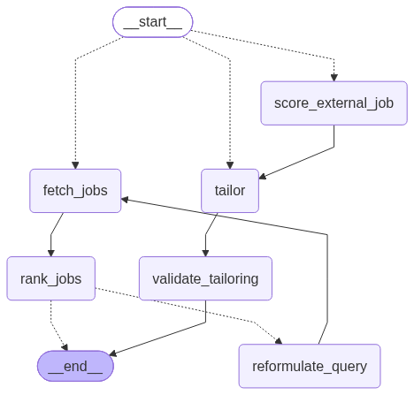

<div align="center">


### 🧭 An AI agent that finds jobs that actually fit — and tailors your CV without lying about it

<p>
  
  
  
  
  
</p>

</div>

---

## 🎯 What Joblyst does

Give it your resume. It **extracts a structured profile**, asks you **where you want to work**, **searches five live job boards concurrently**, **ranks every result against you with an LLM**, and — if the first pass comes back thin — **broadens the search and tries again**. Then, for any job you pick, it **tailors your CV and writes a cover letter**, and runs every generated claim through a **fabrication checker** before you see it, so nothing it writes says something your real CV doesn't back up.

It's a genuine multi-node **LangGraph agent**, not a prompt wrapper: typed state, conditional routing, checkpointed threads, per-node tracing, and a budget guard on LLM spend.

And it's **measured**. Every part of the pipeline that an LLM touches has an eval, a frozen dataset, and a number — and most of this README is the story of what those numbers found.

## ✨ Features

- 📄 **CV → structured profile** — `pypdf` extraction feeding an LLM that turns raw resume text into a typed `Profile` (seniority, roles, skills, projects, years of experience). Today's date is passed in, so "2022 – Present" is computed correctly.
- 🙋 **Preferences asked, not guessed** — where you want to work and whether you want remote are collected from you, because a CV records where you *have* worked, not where you *will*.
- 🔎 **Five-source concurrent job search** — JSearch, Adzuna, Remotive, Himalayas and Jooble queried in parallel, with a soft-deadline cascade so one slow source never blocks the fast ones, and an offline snapshot as the last resort.
- 🧠 **LLM-chosen search query** — the model picks the title, country and remote flag; a deterministic guard cuts any list of roles back to one searchable title.
- 📊 **Batched, parallel ranking** — every job scored 0–100 with matched skills and honest gaps, including a hard rule for experience gaps.
- 🔁 **Self-reformulating search** — under 5 jobs scoring 60+ means the agent picks an adjacent title and searches again, capped at two retries.
- 🧩 **Corpus-grounded tailoring** — your CV is split into small, verbatim, addressable units; every generated bullet must cite the real line it came from.
- 🛡️ **Two-stage fabrication check** — skills are checked by exact lookup; prose is checked by an LLM judge that is deliberately stronger than the model that wrote it, and only flags what a rewrite *adds*, never what it leaves out.
- 📈 **Full Opik tracing and versioned prompts** — every LLM and tool call traced with cost, and every prompt registered so an eval score can be tied to the exact prompt text that produced it.

## 🏗️ Architecture

<div align="center">

</div>

<sub>Rendered directly from the compiled graph (`get_compiled_graph().get_graph().draw_mermaid_png()`) — this is the actual topology, so it can't drift from the code.</sub>

Profile extraction runs once, before the graph. Three ways in, decided by `route_entry`: pasted job text → `score_external_job`; a `selected_job_id` → `tailor`; otherwise a normal search. `fetch_jobs` and `rank_jobs` loop through `reformulate_query` up to twice if too few jobs clear the fit bar, and every tailoring path ends in `validate_tailoring`.

One `StateGraph`, one checkpointer, three entry points — a search and a tailoring run share one thread, so tailoring reads the profile and ranked jobs straight from the checkpoint. Nothing re-runs.

---

## 🔬 The eval story

This is the part I'd want someone to read. Joblyst worked end to end long before it was *right*, and the only way I found that out was by measuring it.

### The scoreboard

| What's measured | How | First number | Now |
|---|---|---|---|
| **Ranking** — is the fit score on the right side of 60? | 46 hand-labelled jobs, deterministic check | 0.870 | **0.891** |
| **Ranking** — are "matched skills" real? | same 46, exact lookup | 0.978 | **0.978** |
| **Profile extraction** — field accuracy | 5 hand-verified CVs, deterministic | 0.569 | **0.738** ¹ |
| **Fabrication** — share of generated claims flagged | 14-case tailoring batch, LLM judge | 0.388 | **⟪RATE⟫** |
| **Routing + query guards** | unit tests, no LLM | — | **28 passing**, 0.2s |

<sub>¹ Partly arithmetic — two fields that a CV cannot answer were moved out of extraction entirely. The real gain is in one field; see chapter 4.</sub>

Every number above came out of a story that looked like this: *the app seemed fine → a measurement disagreed → I read the raw outputs → found the real cause → changed one thing → measured again → kept it or reverted it.* The full record, with every symptom, cause, fix and result, is in [`docs/engineering_log.md`](docs/engineering_log.md).

---

### Chapter 0 — Where it started

By mid-September the agent did everything on the feature list. You could upload a CV, get a ranked list of jobs, pick one, and get a tailored CV back. It looked good.

The problem was that "looked good" was the only evidence. Nothing told me whether a fit score of 85 was right, whether the profile extraction was accurate, or whether the tailored CV was honest. Every output was plausible, and plausible is exactly what an LLM produces whether it's right or not.

### Chapter 1 — Turning the lights on: tracing

The first step was observability: Opik tracing on every node, every LLM call and every job source, with cost. Before measuring anything formally, I just read real traces.

**The first trace I read found the worst bug in the project.** A Senior Data Scientist role needing 4+ years scored **85** for a candidate with 1.5 years, with an explanation that hedged like a coin flip: *"the candidate's specific years of experience were not provided."*

They had been provided. The cause was one misplaced line in `rank_jobs.py`:

```python
def _render_profile(profile, target_role=None):
    base = f"Name: ...\nYears experience: {profile.years_experience}\n..."
    if target_role:
        base += "\nNote: candidate is deliberately targeting..."
        return base        # <- indented one level too far
    return ""              # <- every normal search hit this
```

Every normal search sent the ranker an empty profile. **Every fit score ever produced on a plain search had been generated with no information about the candidate** — and it never errored, because an LLM given nothing doesn't refuse, it invents something plausible.

That changed how I built everything after it. A hollow prompt is worse than a crash, so required prompt inputs now fail loudly:

```python
assert rendered_profile, "rank_jobs: profile rendered empty — refusing to rank blind"
```

I verified the guard fires by reintroducing the original bug on purpose.

### Chapter 2 — Building something to measure against

You can't measure without data you trust. Five pieces:

1. **Fixture CVs.** Five synthetic India-based CVs, deliberately different in structure — a junior data scientist, a senior ML engineer, a teacher pivoting into data, a remote-friendly lead, a mid-level analyst — plus my own real CV. The first batch had been built for the wrong country (London, Berlin, Austin) for an app that only searches India, so they were regenerated.
2. **An offline job snapshot.** 99 real postings saved to disk, so evals don't burn job-board quotas (Jooble allows 500 requests for the *lifetime* of a key) and can be re-run.
3. **Human labels.** I labelled 46 ranking items by hand (was the score right?) and wrote 5 expected profiles field by field. The human owns the labels; the model never writes ground truth.
4. **Two kinds of truth.** Some things are checkable by code — is this skill in the CV, is the score above 60. Others need judgment — is this sentence an exaggeration. The rule: **use code wherever code can answer, and only use an LLM judge for what genuinely needs one.** Most of this suite is deterministic, and that's deliberate.
5. **Versioned prompts.** Every prompt is registered in Opik's prompt library, so each experiment records exactly which prompt text produced it.

### Chapter 3 — Ranking

**The eval.** Replay only the ranking step on each frozen (profile, job) pair with the current prompt, and check two things: is the score on the side of 60 my label says it should be, and are the "matched skills" really in the profile.

**First run: 0.870.** Three of the six misses were jobs for my own CV, all scoring 15–40 points lower than in the original run.

**The bug was in the eval, not the model.** That original run had been a deliberate pivot — my data-engineering CV searching for AI Engineer roles — and the ranker had been told so. The dataset never stored that, so the replay ranked AI roles for a plain data engineer and called it a regression. Storing `target_role` in each item and replaying it brought the score to **0.891**. The lesson: an eval is only fair if it replays the situation the label was made for.

**Then I measured the noise** before trusting any difference. Two runs of the same prompt on 39 items: 36 identical scores, the largest change 10 points, and one item crossing the 60 line. So a one-item swing is noise, not a finding.

**A data limit I couldn't fix.** Adzuna's free API returns only the first **500 characters** of every description — confirmed with a live call, 10 of 10 results — and the full pages return HTTP 403 to scripts. So the ranker never sees a "5+ years required" past that point. I tried a prompt rule telling it the text was cut off and to judge seniority from the title instead. It fixed 2 misses and broke 2 others (it started treating "the text is cut off" itself as a reason to lower scores). Net change: zero. **Reverted**, and logged as a known limitation of free data.

### Chapter 4 — Profile extraction

The profile drives everything downstream: its `primary_roles` become the search query, its `years_experience` feeds the ranker's experience-gap rule. It had never been measured.

**First run: 0.569**, and six real defects nobody had noticed. Each one taught something different.

**`languages` was 0.000 on every CV** — and nothing anywhere ever read the field. **Removed entirely** rather than fixed.

**`primary_roles` was transcribing job history, not searchable roles.** For a junior data scientist it returned `['junior data scientist', 'data science intern', 'undergraduate research assistant']`. Since the first entries become the fallback search query, that searched for internships. The prompt contradicted itself — "roles this person is a fit for" (forward) "ordered with their most recent first" (backward). Rewritten to say what the field is *for*. Result: 0.55 → 0.62, with 3 CVs improving and 2 regressing — a trade, not a clean win.

**A teacher's 11 years were counted as 11 years of data experience.** And it mattered more than one wrong field:

```
Business Data Analyst, VOLTO   — posting requires "8-12 years"
candidate years: 11   ->  model score 60   ->  clears the good-fit bar
explanation: "requires 8-12 years, which is at the upper limit of her experience"
```

The ranker's experience-gap rule *inverted*: fed 11, it confirmed a senior role fit a career changer with almost no data experience. That job was one of the six I'd labelled wrong in the ranking review. **One extraction bug, showing up as a failure in two different evals** — and the ranking eval couldn't diagnose it, because ranking an 11-year candidate against an 8–12 year role at 60 is correct reasoning on bad input. Fixed to count only paid experience in the relevant field: 11 → 2.

*This was a regression by the metric* (0.697 → 0.656), because my label says `None` and 2 still scores zero. **I kept it anyway** — the metric is binary and can't see that the real harm, the inverted ranking, is gone. Choosing against the number, and writing down why, felt like the honest call.

**`locations` and `remote_ok` could never be right**, because a CV doesn't contain them. "Open to hybrid" — remote or not? Four cities listed — are those past offices or preferences? The model was being graded on a question the document doesn't answer. **Moved out of extraction entirely**: the app now asks the user. The score jumped to 0.738, but I'm explicit that most of that is arithmetic from dropping two bad fields. The real gain was a side effect: with those removed, `primary_roles` stopped inventing roles like `data architect` and `ml platform lead`, going 0.62 → 0.77.

**The model thinks it's October 2023.** One CV failed `years_experience` in every run no matter what I changed. It turned out to be the only CV without a line like "8 years of experience", so the model had to compute from dates — and asked directly, gpt-4o-mini answers *"Today's date is October 4, 2023."* Every "2022 – Present" was being counted to 2023. Four of five fixtures hid this by stating their years in prose, but in production it would understate **every CV with a current job**. Fixed by passing the real date in: 2.0 → 4.0.

**What that exposed, and what I left open.** 4.0 is only the *current* role; the honest answer is 5. I tried three fixes — an explicit "add up every role" rule, a near-identical worked example, and a reasoning field in the schema — and none worked. Asked the same question free-form with "show your work", the model gets 5 correctly. Through structured output, it won't. **It reads dates reliably and adds them unreliably.** The real fix is to have the model extract the date ranges and compute the total in Python. Deferred, and written down.

### Chapter 5 — Search queries and routing

**Routing** is plain Python — same state, same branch, every time — so it gets **unit tests, not an eval**. 14 tests pin the decisions that could silently break, like whether exactly 60 counts as a good score. To check the tests have teeth, I wrote three deliberately broken versions of the routers; all three were caught.

**A search query matched nothing at all.** A trace showed the agent searching for:

```
'Data Analyst OR Business Analyst OR'
```

No job is titled that. The LLM had returned a 7-word list; the guard cut it to 6 words by count, leaving a dangling `OR`. Fixed by splitting on list separators *before* cutting by length, so it becomes `'Data Analyst'`. Slashes and ampersands are deliberately kept, because `AI/ML engineer` and `R&D engineer` are real single titles.

**Then one LLM call fired 16 job searches.** The cause was a different node. The query-broadening step had no rules about shape, so it produced:

```
'Data Analyst OR Business Analyst OR Analytics OR Data Scientist OR ...
 OR SQL OR Excel OR Looker OR Python OR DBT OR Snowflake OR Tableau ...'
```

16 terms. The search step obediently issued **one search per term**, including `SQL` and `Excel`, which are skills, not job titles. That case made ~32 searches and found the *fewest* jobs of any — because "broader" had been implemented as "more terms", and a list matches no posting. Given the same one-title rule as the search step: **16 tool calls → 2**.

### Chapter 6 — The fabrication check

This is the feature the project is named for — and the measurement that surprised me most.

**First batch: 39% of generated claims flagged.** 144 flags across 371 claims, every tailored run flagged. A tailoring model that invents 4 lines in 10 would be unusable. Reading the flags, almost none were inventions. Three separate causes:

**1. The cheap check can't tell direction.** It scores text similarity and flags anything below 0.65. Honest shortening scores low:

```
real CV : Migrated a critical Airflow DAG delivering company/account data to
          Salesforce CRM into a Databricks workflow, reducing latency by 40%.
rewrite : Migrated critical workflows from Airflow to Databricks, reducing
          data processing latency by 40%.          -> similarity 0.55, FLAGGED
```

Nothing invented. All 99 flags from this stage were on prose, and every one I read was a summary.

**2. The LLM judge flagged omissions — which its own prompt forbade.** At least half its flags said *"the rewrite omits…"*, against three separate sentences telling it omission is fine. One was worse: when a rewrite dropped the word *"three"*, it reported that the rewrite had **added** a detail. An earlier entry in my own engineering log recorded this exact problem as *fixed*. It wasn't — I'd changed the wording and never re-measured. **A prompt fix without a measurement is a hope.**

**3. The CV parser split a sentence in half** — `"...at a p99 latency of"` / `"45ms."` — because a line starting with a digit wasn't treated as a continuation. So the judge was correctly told "45ms" wasn't in the source it was shown.

**The fix.** Repaired the parser; gave the judge one simple rule — *flag only what a rewrite says that the CV doesn't; leaving things out is always fine* — with eight worked examples from unrelated domains (so a re-run can't pass by memorising the real claims); and made the judge a **stronger model than the one writing the CV**, since a judge no better than the writer shares its blind spots.

**Measured on the same 45 claims, only the judge changing:**

| judge | still flagged |
|---|---|
| original prompt, gpt-4o-mini | 40 / 45 |
| new prompt, gpt-4o-mini | 32 / 45 |
| **new prompt, gpt-4.1** | **7 / 45** |

All 7 survivors are real, and each quotes the invented phrase:

```
"fostering a strong understanding of data analysis concepts"   — invented outcome
"improving educational outcomes and student performance"       — invented outcome
"through innovative teaching methods and data analysis"        — invented cause
"Managed and optimized ... enhancing data accessibility"       — inflated role
```

**The pattern is the useful part:** every real fabrication is vague, flattering padding on the career-changer's teaching bullets. None invented a tool or changed a number. That tells me exactly where the tailoring prompt is weak.

**Full batch re-run with the new judge: ⟪RATE_LINE⟫**

**The trade-off, accepted deliberately.** The stronger judge is slower and costs more, and this account's rate limit (30,000 tokens a minute) meant capping it to 3 calls at once with retries — without that, a rate-limit error inside the graph would fail the whole tailoring run. The check went from ⟪CHECK_TIME_LINE⟫. Worth it: tailoring is a one-off action a user already waits ~14 seconds for, and a checker that flags 39% of lines teaches people to ignore it — which hides the 2% that are real.

### Chapter 7 — What I tried and didn't keep

Knowing what *not* to keep is half of this. Each was measured before it was dropped:

| Tried | Result | Decision |
|---|---|---|
| Opik's automatic prompt optimizer on extraction | one run 0.648 → 0.711, the next run found nothing; its rewrites dropped my domain rules | **Not adopted** — 5 examples is far too few for it to tell signal from noise |
| `gpt-5-mini` for extraction | 0.553 vs 0.656, and 4.5× slower | **Rejected** — it produced roles like `data analyst (mid)` that break the search query |
| A "description is cut off" ranking rule | fixed 2, broke 2, net 0 | **Reverted** |
| A reasoning field to make the model add up years | made it worse (4.0 → 3.5) | **Reverted** — move the arithmetic into code instead |

One honest note on the metric itself: `gpt-5-mini` lost points on `skills` partly for being *right* — it added `flask` and `streamlit`, which are in the CV but missing from my label. A metric is only as good as its labels.

### What I'd say I learned

- **Read the raw outputs before trusting a number.** The 39% fabrication rate was real arithmetic about the wrong thing.
- **An LLM never refuses for lack of context** — it invents. Required inputs must fail loudly.
- **A bug often shows up somewhere other than where it lives.** The worst ranking error came from extraction; the worst search fan-out came from the reformulation node.
- **Keep arithmetic out of the model.** Both date bugs were arithmetic.
- **Ask the user for what the document can't contain.**
- **A prompt is a request, not a guarantee.** Every prompt rule that matters has a deterministic guard behind it.
- **Sometimes keep a change the metric dislikes** — but write down why.

### Still open

- `years_experience` doesn't add up multiple roles (4 instead of 5). Fix: extract date ranges, compute in code.
- The career-changer label — `None` or `2` years of data experience — is a judgment call the extractor can't settle.
- `primary_roles` has a contradiction I introduced by accident: "extract only what the CV states" vs "include the natural next step".
- The search step can still repeat the same query twice, and the LLM budget guard counts one call where it authorises several searches.
- Fabrication-judge **recall** is unmeasured: I've confirmed it stops false alarms, not that it catches everything.
- Adzuna's 500-character descriptions are a hard limit of free data.

---

## ▶️ Running the evals

```bash
# fast, offline, no API key
uv run pytest tests/ -q

# replay ranking on the 46 labelled items (needs OPIK_API_KEY)
uv run python -m evals.run_evals --suite ranking --yes

# re-extract the 5 fixture CVs and score them field by field
uv run python -m evals.run_evals --suite extraction --yes
uv run python -m evals.run_evals --suite extraction --yes --model openai:gpt-5-mini

# search + tailor 14 cases and report the fabrication rate (~$0.15)
uv run python scripts/run_tailor_batch.py --yes
```

Every script prints its plan and estimated cost and stops unless you pass `--yes`.

## 🧰 Tech stack

| Layer | Choice |
|---|---|
| Agent orchestration | **LangGraph** + **LangChain** |
| LLMs | OpenAI — `gpt-4o-mini` for extraction, ranking and tailoring; `gpt-4.1-nano` for search queries; **`gpt-4.1` as the fabrication judge** |
| Observability & evals | **Opik** — traces, spans, cost, datasets, experiments, prompt library |
| Data validation | **Pydantic v2** |
| Job sources | JSearch, Adzuna, Remotive, Himalayas, Jooble, plus an offline snapshot |
| Company research | Tavily |
| PDF parsing | pypdf |
| Testing | pytest |
| Config | pydantic-settings (`.env`-driven) |
| Package/runtime | Python 3.12, [`uv`](https://docs.astral.sh/uv/) |

## 🚀 Getting started

```bash
uv sync --all-groups
cp .env.example .env          # add OPENAI_API_KEY at minimum
uv run python scripts/check_setup.py
uv run streamlit run app.py
```

Everything else — job-source keys, Opik, the judge model, ranking knobs — is documented in `.env.example`. The app runs with just an OpenAI key; every other integration degrades gracefully when its key is absent.

## 🗺️ Status

| Piece | State |
|---|---|
| CV → profile extraction | ✅ done, evaluated |
| Multi-source concurrent search | ✅ done |
| Ranking + reformulation loop | ✅ done, evaluated |
| Corpus-grounded tailoring | ✅ done |
| Fabrication validator | ✅ done, evaluated |
| External job scoring (paste a posting) | ✅ done |
| Target-role override | ✅ done |
| Streamlit testbed UI | ✅ done |
| Eval suite — ranking, extraction, fabrication, routing tests | ✅ done |
| Fabrication-judge recall, LLM-judge calibration | 🔄 next |
| CI gate that fails a change when a score drops | 📋 planned |

Built by following [jamwithai/observable-job-agent](https://github.com/jamwithai/observable-job-agent) to learn production LangGraph patterns firsthand — then diverging where the evidence pointed somewhere better: extra job sources, user-supplied preferences, a hand-labelled extraction eval, and a fabrication judge rebuilt after measuring how often the original one was wrong.

---

<div align="center">
<sub>Built with LangGraph, Opik, and a habit of measuring every design decision before trusting it.</sub>
</div>
